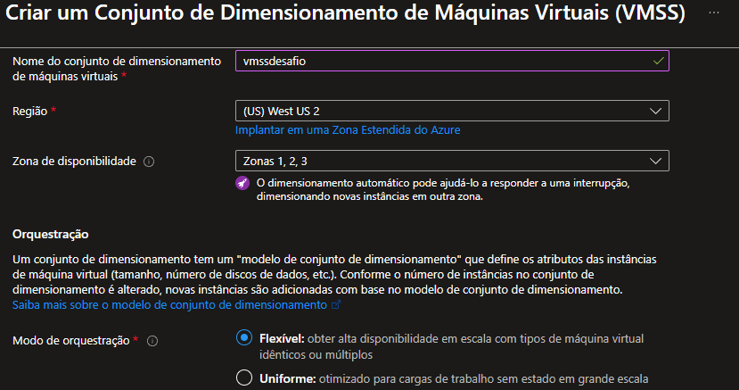
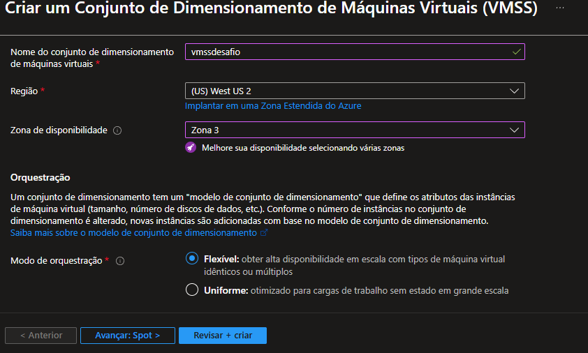
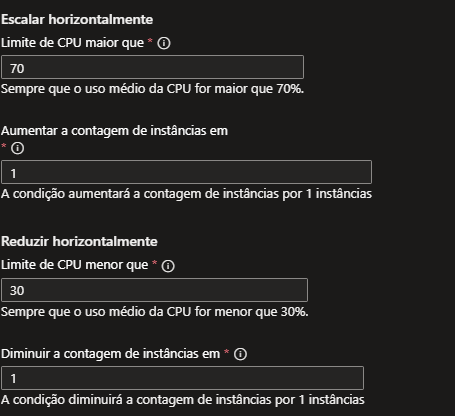

# Desafio 5 - Azure VM com Dimensionamento Automático

## 📌 Objetivo
Praticar a criação de uma **Máquina Virtual no Azure** com configuração de **dimensionamento automático (autoscale)**, garantindo elasticidade e alta disponibilidade conforme a demanda de uso.

## 🚀 Passo a Passo
1. Criação de uma instância de VM no **Azure Virtual Machine Scale Set (VMSS)**.  
2. Definição da **região** e configuração de **zona de disponibilidade** para resiliência.  
3. Configuração inicial do **dimensionamento automático**, estabelecendo limites mínimos, padrão e máximos de instâncias.  

## 🖼️ Evidências

### 01 - Criando VM

### 02 - Definindo Região e Zona de Disponibilidade

### 03 - Configurando Dimensionamento Automático

## 📚 Conclusão
Com o autoscale configurado, o ambiente pode aumentar ou reduzir o número de instâncias automaticamente de acordo com a carga de trabalho, garantindo **otimização de custos** e **disponibilidade contínua**.

✍️ Autor

Rodrigo – Analista de Dados